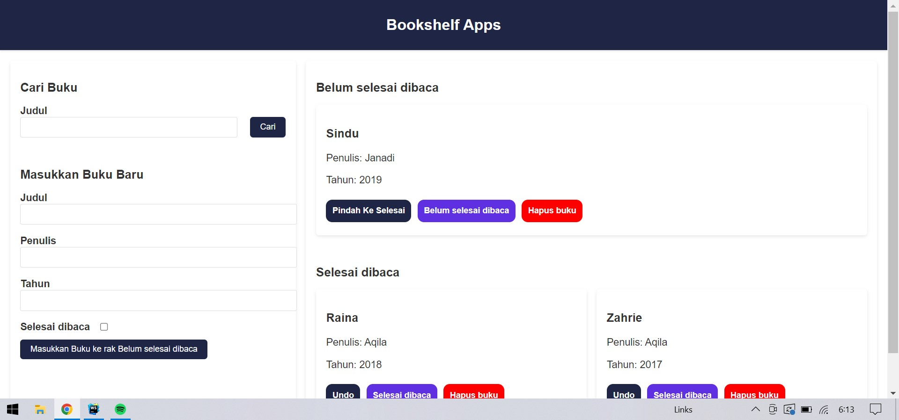

# 📚 Bookshelf App

Aplikasi Manajemen Buku guna meneyelesaikan tugas akhir dari course dicoding, aplikasi ini memiliki beberapa fitur seperti


## Fitur

 - Menambah Buku
 - Menghapus Buku
 - Memindahkan Antar Rak
 - Mencari Buku


## Installation

Install my-project

```bash
  git clone git@github.com:Sinduaditya/Bookshelf-app.git
  cd Bookshelf-app
```

    
## Screenshots

### Halaman Utama



### Menambah Buku 


Dan apa bila cheklist selesai di bava di klik maka akan menjadi


### Setelah di Add 


### Pesan Sebelum di Hapus


### Fitur Search


## Tech Stack

**Tech:** HTML5, CSS, JavaScript


